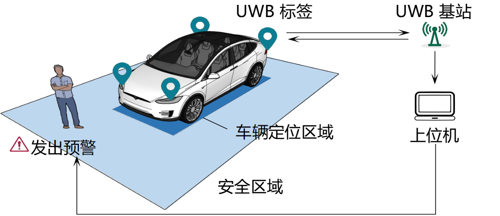

## 2024.11.29
本项目为行人与车辆区域定位与预警系统，目的是在化工厂、生产车间等人车交互频繁的工业场景感知与监测场景中的行人与车辆，当行人与车辆即将发送危险时给出预警提示，从而规避危险的发生。之所以叫**车辆区域定位系统**，是因为该定位系统可以对车辆所在区域进行建模，提供形状、转向等信息，以提升定位的精度与预警的准确率。

对应论文链接：https://ieeexplore.ieee.org/abstract/document/10558718

  
  
车辆区域定位示意

#### 本项目现阶段的功能主要如下：
1. **多UWB标签定位**，其中包括行人标签与车辆标签（目前代码支持1人与1车的demo场景），支持TWR与TDOA两种定位算法；
2. **预警模块**：当判断行人与车辆、车辆与车辆间的距离小于阈值，触发预警模块；
3. **数据记录**：对实验采集的坐标、距离、信号强度等信息记录，方便实验分析；
3. **NLoS场景识别模块**：输入UWB标签的测距、第一路径信号强度、接收信号强度数据，可以识别该信号是否处于NLoS环境中；
4. **IMU传感器融合定位模块**：用于补偿NLoS场景的误差，利用IMU提供的加速度数据与UWB信号的测距数据进行融合定位。

#### 启动：
1. 启动主文件即可启动定位系统：main.py
2. 画图分析：analysis.py
3. 训练与测试NLoS识别算法：random_forest_model.py

## 2023.4.2
现阶段该套代码主要的功能为uwb多标签定位以及区域碰撞检测。

代码主要分为三部分：

1. server.py

作为主函数调用，主要是创建TCP服务端开始接受uwb基站传来的串口数据，以及设置一些实验的参数

2. portv2.py

解析串口数据，以及定位算法、可视化的具体实现

3. buildAnddetection.py、GJK.py

一些工具函数，如矫正矩阵、碰撞检测等

  

